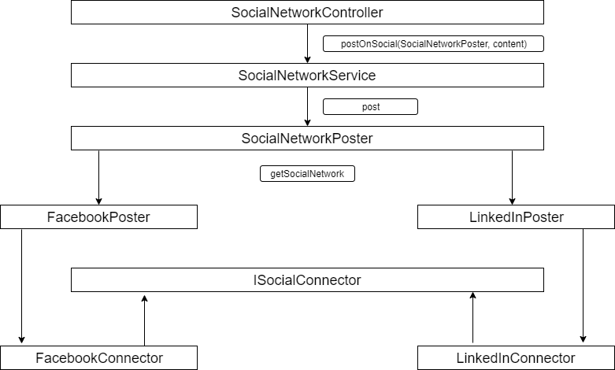

# Factory Method Pattern

`Factory Method pattern`-i `PHP`-da juda keng qo'llaniladi. Bu pattern-dan kodingizga o'zgartirish kiritishni osonlashtirish uchun ishlatiladi.

`Factory Method pattern`-ini kodda klasslardan obyekt olib, abstrakt tip yoki interfeys obyekti sifatida qaytaradigan metodlar yaratilganiga qarab aniqlab olish mumkin.

Misol.

Ushbu misolda `Factory Method pattern`-i ijtimoiy tarmoqlarga post qoldirish imkoniyatini berish uchun interfeyslarni yaratishga asoslanadi. Interfeyslardan foydalanib, foydalanuvchi tarmoqqa kirish, xabarlar yaratish va boshqa ishlarni bajarishi mumkin. Asosiysi bu mijoz kodini ma'lum bir ijtimoiy tarmoqning alohida klasiga bog'lanib qolishining oldini oladi.

Avval, `App\FactoryMethod\SocialNetworks\Contracts\ISocialNetworkConnector.php` faylini ochib olamiz:

```bash
interface ISocialNetworkConnector
{
    public function logIn(): void;

    public function logOut(): void;

    public function createPost(string $content): void;
}
```

Keyin esa Connector-larni yaratamiz. Connector klaslari `ISocialNetworkConnector` interfeysini ishlatadi. Bu klasslarning vazifasi ijtimoiy tarmoqqa login va paroli yordamida kirish va post qoldirgandan so'ng tarmoqdan chiqib ketish hisoblanadi:

`App\FactoryMethod\SocialNetworks\Connectors\FacebookConnector.php`:

```bash
class FacebookConnector implements ISocialNetworkConnector
{
    private $login;

    private $password;

    public function __construct(string $login, string $password)
    {
        $this->login = $login;
        $this->password = $password;
    }

    public function logIn(): void
    {
        // Facebook-ka login

        echo "$this->login foydalanuvchi facebook-ka kirdi";
    }

    public function logOut(): void
    {
        // Facebook-dan chiqib ketish

        echo "$this->login foydalanuvchi facebook-dan chiqib ketdi";
    }

    public function createPost(string $content): void
    {
        // Facebook-da post qoldirish

        echo "$this->login foydalanuvchi facebook-da post qoldirdi";
    }
}
```

`App\FactoryMethod\SocialNetworks\Connectors\LinkedInConnector.php`:

```bash
class LinkedInConnector implements ISocialNetworkConnector
{
    private $email;

    private $password;

    public function __construct(string $email, string $password)
    {
        $this->email = $email;
        $this->password = $password;
    }

    public function logIn(): void
    {
        // LinkedIn-ga kirish
        echo "$this->email foydalanuvchi LinkedIn-ga kirdi";
    }

    public function logOut(): void
    {
        // LinkedIn-dan chiqish
        echo "$this->email foydalanuvchi LinkedIn-dan chiqdi";
    }

    public function createPost(string $content): void
    {
        // LinkedIn-da post qoldirish
        echo "$this->email foydalanuvchi LinkedIn-ga post qoldirdi";
    }
}
```

So'ngra, `App\FactoryMethod\SocialNetworks\Base\SocialNetworkPoster.php` faylni yaratamiz:

```bash
abstract class SocialNetworkPoster
{
    abstract public function getSocialNetwork(): ISocialNetworkConnector;

    public function post($content): void
    {
        $network = $this->getSocialNetwork();

        $network->logIn();
        $network->createPost($content);
        $network->logOut();
    }
}
```

Bu klasda faqat bitta post nomli metod bor. post metodi bola klasda berilgan connector klasini olib, undagi barcha metodlarni berilgan ketma-ketlikda ishlatib beradi.
Oxirida, post qoldiruvchi klaslarning o'zi yoziladi:

`App\FactoryMethod\SocialNetworks\FacebookPoster.php`:

```bash
class FacebookPoster extends SocialNetworkPoster
{
    private $login;

    private $password;

    public function __construct(string $login, string $password)
    {
        $this->login = $login;
        $this->password = $password;
    }

    public function getSocialNetwork(): ISocialNetworkConnector
    {
        return new FacebookConnector($this->login, $this->password);
    }
}
```

`App\FactoryMethod\SocialNetworks\LinkedInPoster.php`:

```bash
class LinkedInPoster extends SocialNetworkPoster
{
    private $email;

    private $password;

    public function __construct(string $email, string $password)
    {
        $this->email = $email;
        $this->password = $password;
    }

    public function getSocialNetwork(): ISocialNetworkConnector
    {
        return new LinkedInConnector($this->email, $this->password);
    }
}
```

Ishlatilishi:

`App\Services\SocialNetworkService.php` fayli:

```bash
class SocialNetworkService
{
    public function postOnSocial(SocialNetworkPoster $poster, $content)
    {
        $poster->post($content);
    }
}
```

`SocialNetworkController` kontrolleri: `php artisan make:controller SocialNetworkController`

```bash
class SocialNetworkController extends Controller
{
    private $service;

    public function __construct(SocialNetworkService $service)
    {
        $this->service = $service;
    }

    public function createPost(Request $request)
    {
        // request validatsiya qilinadi

        $network = $request->input('network');
        $content = $request->input('content');

        $network = "\App\FactoryMethod\SocialNetworks\\" . Str::ucfirst($network) . "Poster";

        $config = config("socials.$network");

        $this->service->postOnSocial(
            new $network(
                $config['login'],
                $config['password']
            ),
            $content
        );
    }
}
```

Ishlash ketma-ketligi:
SocialNetworkController -> SocialNetworkService -> FacebookPoster yoki LinedInPoster -> FacebookConnector yoki LinkedInConnector
